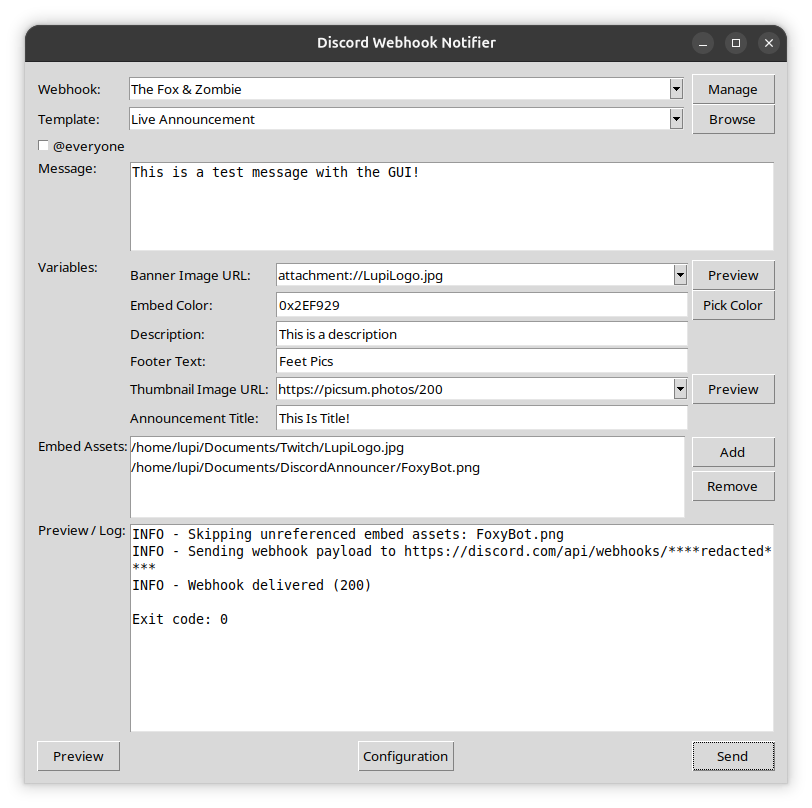
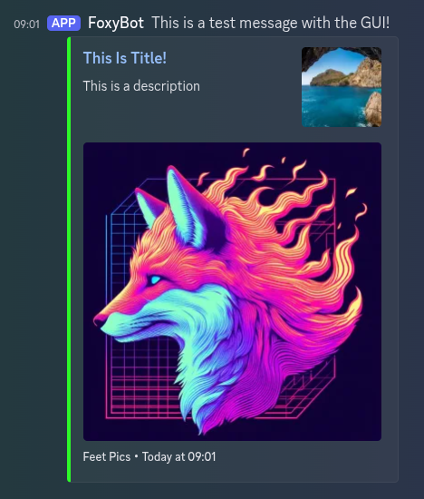

# Discord Webhook Notifier

Discord Webhook Notifier is a Python application for crafting Discord webhook messages with reusable templates. It ships with a command line interface and a Tk-based desktop helper; both produce identical payloads by sharing the same execution path.

 


## Why Use It?

- Keep announcement embeds consistent by rendering Jinja2 templates to Discord-compatible JSON.
- Merge configuration from `.env` files, environment variables, and CLI overrides without leaking secrets.
- Post messages with optional attachments, `@everyone` prefixes, and safe default mention settings.
- Handle Discord rate limits gracefully by retrying once with respect for the provided delay.

## Install & Setup

- Linux/macOS: run `./launch-linux.sh`
- Windows (PowerShell): `.\launch-windows.ps1`

Both scripts create/activate `.venv`, upgrade `pip`, install dependencies, and start the Tk GUI in one go. Re-run them any time; they reuse the existing environment.

If you prefer to manage the environment yourself instead:

```bash
python3 -m venv .venv
source .venv/bin/activate
pip install --upgrade pip
pip install -e .[dev]
```

Copy `.env.example` to `.env` and fill in at least `DISCORD_WEBHOOK_URL`. Optional values like `BOT_USERNAME`, `BOT_AVATAR_URL`, `TWITCH_CHANNEL`, and `DEFAULT_COLOR` serve as template defaults.

## Command Line Reference

Basic invocation:

```bash
python3 -m src.main \
  --template templates/live_announcement.json.j2 \
  --message "Stream is live!" \
  --var TWITCH_CHANNEL="FoxyLupi"
```

Set `TWITCH_CHANNEL` once via `.env`, the GUI configuration dialog, or a one-off `--var` assignment—the live announcement template automatically links to `https://twitch.tv/<channel>`.

Helpful flags:

- `--file PATH[::DESCRIPTION][::CONTENT_TYPE]` upload an embed asset (reference via `attachment://filename` in templates).
- `--upload PATH[::DESCRIPTION][::CONTENT_TYPE]` attach a raw file to the message body.
- `--json-var key=<json>` provide structured values (lists/objects) directly to templates.
- `--everyone` prepend `@everyone, ` to the message body.
- `--allow-mentions everyone,roles` opt into additional mention types; defaults disallow mass pings.
- `--dry-run` render JSON to stdout without contacting Discord.
- `--no-retry` disable the automatic retry after a 429 response.
- `--webhook URL` send to a specific webhook; repeat for multiple URLs.
- `--wait-for-live` poll Twitch for `TWITCH_CHANNEL` every 45s (up to 1 hour) before sending the webhook.

Exit codes: `0` success, `2` invalid input, `3` HTTP failure, `4` rate limit exhausted, `5` template error.

## Templates & Variables

Templates live in `templates/` and use the `.json.j2` suffix. Render-time variables come from, in order of precedence:

1. `.env` and process environment values.
2. CLI overrides such as `--webhook`.
3. `--var key=value` assignments.

The rendering context also exposes `message`, `message_prefix`, `now_iso` (UTC timestamp), and all normalized environment keys. Templates must produce a single JSON object; the application validates Discord field length limits before sending.

To mirror Discord's embed structure without repeating JSON fragments, helpers are available inside every template:

- `embed_footer(text, icon_url=None, proxy_icon_url=None)` returns a properly-shaped footer object.
- `embed_field(name, value, inline=False)` produces embed field dictionaries.
- `embed_timestamp(value=None)` formats datetimes as RFC3339/ISO strings (defaults to now when omitted).

Pair these helpers with the built-in `|tojson` filter to inline them directly into JSON payloads.

Structured inputs created via the GUI (for example, repeating embed fields) are sent through `--json-var` so you can populate the same data from the CLI by providing JSON literals.

## Attachments

Use `--file path/to/banner.png::Alt text::image/png` for embed assets; only referenced filenames are uploaded so stray files cannot leak into the message body. Pair this with `attachment://banner.png` anywhere an image URL is expected. When you need to include a standard file download alongside the embed, use `--upload path/to/report.pdf` instead. Both switches respect the same optional description and MIME override syntax, and Discord’s 10-attachment limit still applies to the combined total.

## Tk GUI Companion

Launch the graphical frontend with:

```bash
python3 -m src.notifier.gui_tk
```

The window lets you pick a webhook, template, message, variables (one `key=value` per line), and attachments. “Preview” runs the CLI with `--dry-run` and shows the captured output; “Send” executes the real request. Recent inputs persist in `~/.discord-webhook-notifier/state.json`.

Template metadata can opt into richer field types (such as repeating embed fields). Those controls serialize to JSON automatically and are passed to the CLI via `--json-var`, so the GUI, CLI, and automation all share the same structured data path.

Toggle “Post when I go live” to pass `--wait-for-live` to the CLI, which polls Twitch for your configured `TWITCH_CHANNEL` every 45 seconds for up to one hour before sending the webhook when live.

## Development

- `python3 -m src.main --help` lists the full CLI surface.
- `pytest` executes the unit test suite (install `.[dev]` extras first).
- Project metadata and dependencies are declared in `pyproject.toml`; the package exposes a `discord-webhook-notifier` console entry point when installed.

## License

GPL-3.0-or-later.
